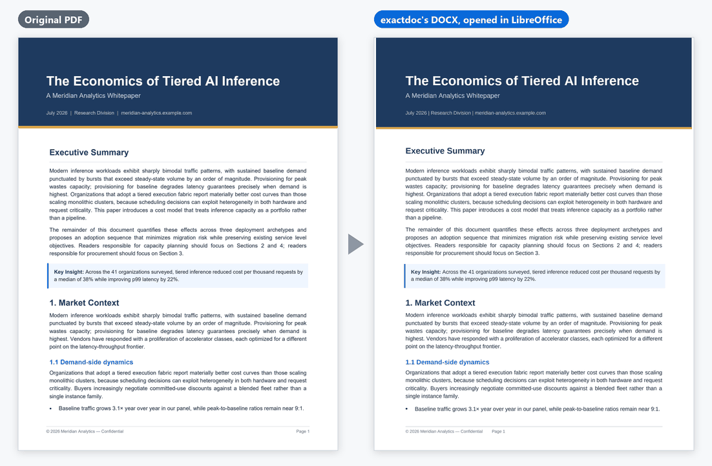
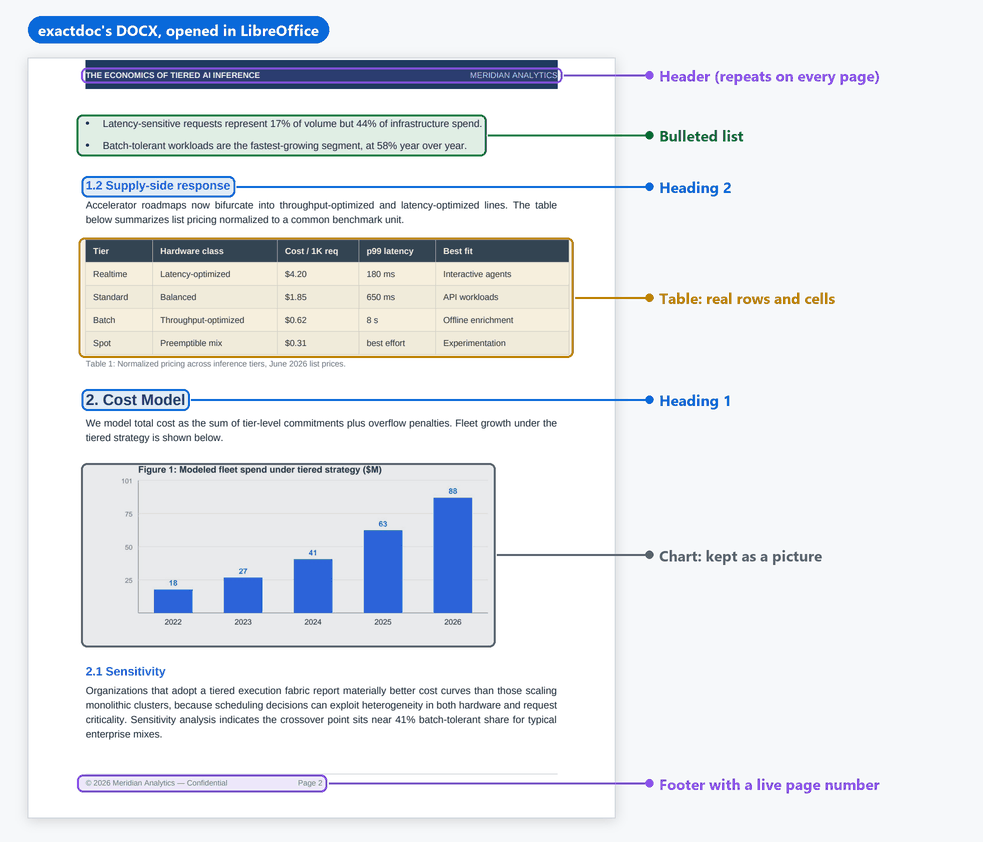
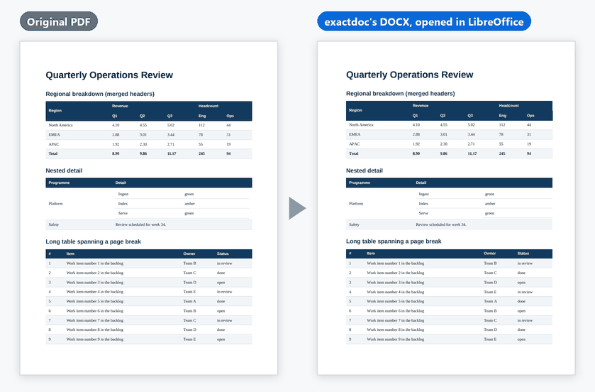
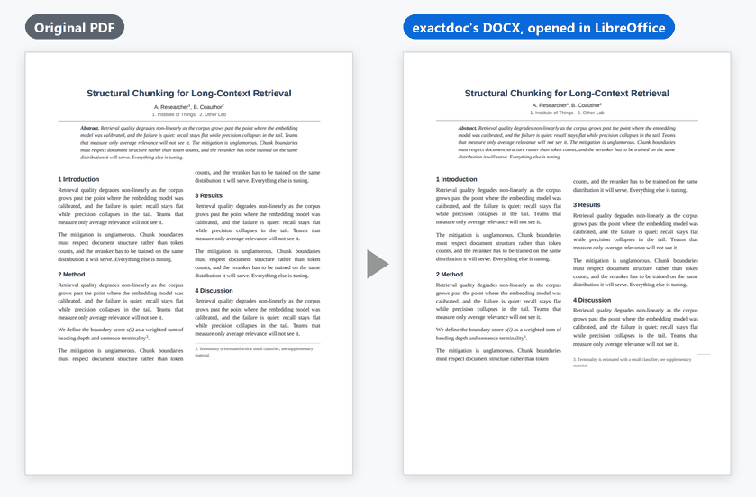
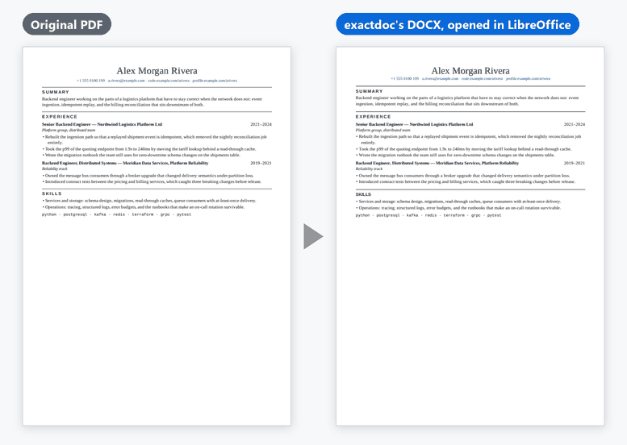
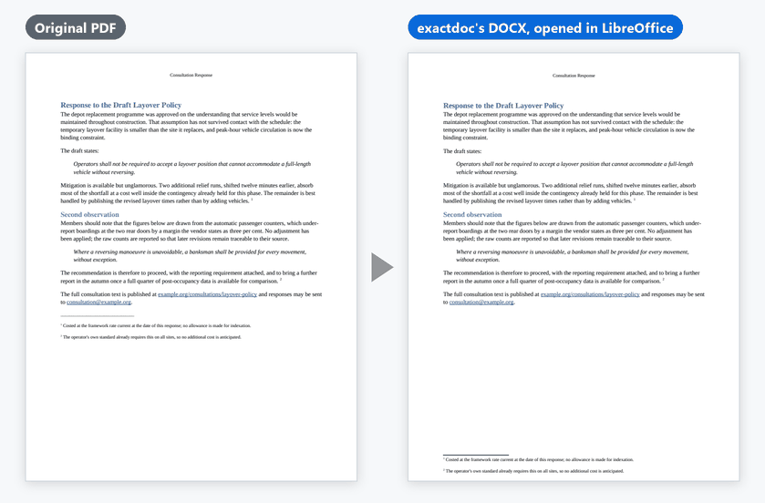
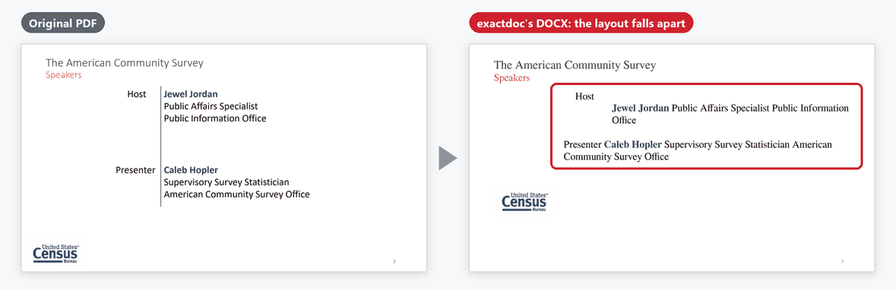
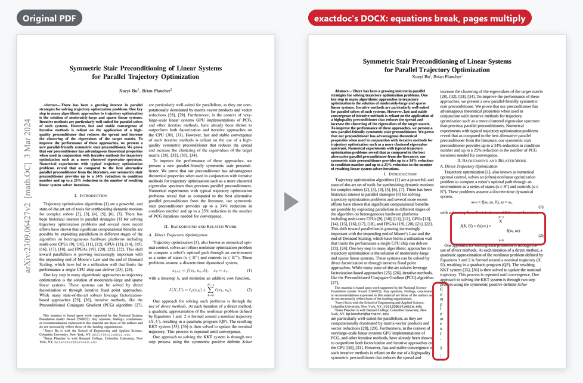
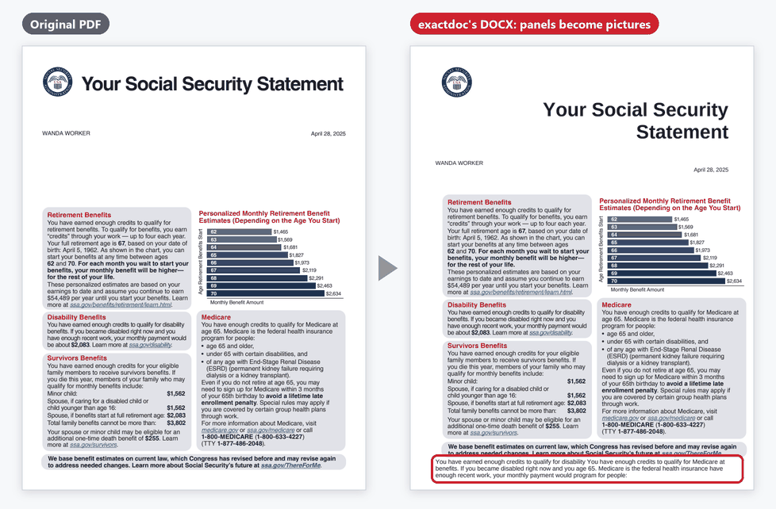

# exactdoc

**exactdoc turns a PDF into a Word document (DOCX) that looks like the original
and that you can actually edit.**

Most PDF-to-Word converters give you one of two things: text boxes frozen in
place (looks right, painful to edit) or plain reflowed text (easy to edit, looks
wrong). exactdoc writes real headings, paragraphs, lists and tables, and places
them so the page matches the PDF. Every change is measured against real
renderers, and conversion runs entirely on your machine.

> **Alpha (version 0.2.0a1).** It works well on ordinary digital documents and is
> still changing quickly. The [Works well / Not yet](#what-works-and-what-does-not-yet)
> section below shows both sides with real examples.



<sub>Page 1 of a test whitepaper from this project's own corpus, converted with the
default settings. Small differences remain: the footer's page number sits further
left than in the PDF.</sub>

## Install

You need Python 3.9 or newer (check with `python --version`). A clean install
was checked on Linux and Windows
([record](docs/evidence/beta-install-2026-10-05.json)):

```bash
pip install exactdoc
exactdoc --version
```

> **Not on PyPI yet.** The first beta (0.3.0b1) is being prepared, and until it
> is published `pip install exactdoc` finds nothing. Install from a copy of this
> repository instead:
> `git clone https://github.com/ebt55/exactdoc && cd exactdoc && pip install .`

That is all you need to convert PDFs. Two things are optional:

- **[LibreOffice](https://www.libreoffice.org/download/)** (free) gives the best
  layout. When it is installed, exactdoc opens its own DOCX in LibreOffice,
  compares each page with the PDF and corrects page breaks and spacing. Without
  it, exactdoc converts in one pass and prints a note saying so. The check takes
  time: in the project's test container a 31-page IRS publication took 66
  seconds with it and about 15 without
  ([measurement](docs/evidence/refine-speed-2026-10-05.json)). `--refine 0`
  skips it.
- **The Google Docs tools** (`pip install "exactdoc[gdocs]"`) measure a DOCX
  inside Google Docs with your own Google account. You do not need them to make
  a DOCX for Google Docs: `--output-profile gdocs` works offline in every
  install.

## Quick start

```bash
# Convert one PDF: writes report.docx next to report.pdf
exactdoc report.pdf

# Choose the output name
exactdoc report.pdf -o converted/report.docx

# Make a DOCX for Google Docs (still offline: nothing is uploaded)
exactdoc report.pdf -o report.docx --output-profile gdocs --refine 0

# Convert a whole folder, including subfolders
exactdoc --input-dir pdfs --out-dir docx --recursive

# Faster: skip the LibreOffice layout check
exactdoc report.pdf --refine 0
```

exactdoc never replaces a file you did not name: if `report.docx` already
exists, `exactdoc report.pdf` stops and asks for `-o` or `--overwrite`. Long
documents show their progress while they convert.

From Python:

```python
from exactdoc import convert

convert("report.pdf", "report.docx")
```

The Google Docs option writes the same document in a form that Google Docs'
importer reads correctly. Upload the DOCX to Google Drive and open it with Google
Docs. Every option, exit code and batch limit is in [docs/usage.md](docs/usage.md).

## What "editable" means here

The DOCX is built from the same pieces you would use to write the document in
Word yourself, not from text boxes pinned to the page:



- **Headings** use Word's heading styles, so the navigation pane and Google Docs'
  outline work.
- **Paragraphs** flow and re-wrap when you edit them.
- **Lists** are real bulleted and numbered lists.
- **Tables** are real tables, including merged cells and tables that run over
  several pages.
- **Headers and footers** repeat on every page, with live page numbers.
- **Footnotes** are real Word footnotes. (In the Google Docs output they stay
  ordinary text, because Docs moves real ones.) **Links** still work.
- Charts, logos and artwork stay **pictures**, placed where the PDF has them.

## What works, and what does not yet

### Works well

Ordinary digital documents: reports, memos, letters, whitepapers, simple papers
and résumés.

<table>
<tr>
<td width="50%"></td>
<td width="50%"></td>
</tr>
<tr>
<td><b>Tables</b> become real Word tables with merged cells. A table-within-a-table is rebuilt as one table with merged cells.</td>
<td><b>Two-column pages</b> keep their columns as a real two-column section.</td>
</tr>
<tr>
<td></td>
<td></td>
</tr>
<tr>
<td><b>Résumés</b>: role and date on one line, rules under section headings, bullet lists.</td>
<td><b>Quotes, links and footnotes.</b> Footnotes become real Word footnotes, so they move to the foot of the page.</td>
</tr>
</table>

<sub>All four are test documents this project generated (Apache-2.0). Each DOCX
was rendered by LibreOffice in the project's pinned test container.</sub>

### Not yet

Real-world documents vary more than test documents. These are the main gaps,
shown on public documents converted with the default settings.



<sub><b>Slide decks.</b> Slide 3 of a US Census Bureau webinar deck (public domain).
Slide layouts fall apart, and the 40-slide deck became 72 pages.</sub>

<table>
<tr>
<td width="50%"></td>
<td width="50%"></td>
</tr>
<tr>
<td><b>Dense journal papers with equations.</b> Bu and Plancher, arXiv:2309.06427 (CC BY 4.0). Equations come apart, and the 8-page paper became 19 pages.</td>
<td><b>Heavily designed layouts.</b> A sample Social Security Statement (US government, public domain; "Wanda Worker" is SSA's fictional sample). It looks close, but the grey panels became pictures: only about 12% of the words stay editable, and some text spills out below.</td>
</tr>
</table>

| Kind of PDF | Today |
|---|---|
| Reports, memos, letters, whitepapers | ✅ Works well. Long reports can gain pages: 12–22% more on NIST publications of 59–114 pages ([sweep](docs/evidence/engine-sweep-2026-09-11b.json)) |
| Tables (merged cells, tables over several pages) | ✅ Works well |
| Simple two-column layouts | ✅ Works well |
| Résumés | ✅ Mostly. Some designed two-column templates still spill onto an extra page |
| Headers, footers, page numbers, footnotes, links | ✅ Works well |
| Latin, Cyrillic and Greek text | ✅ Works well |
| Chinese, Japanese and Korean text | ⚠️ Partly. The text survives, but some runs become pictures |
| Long documents in Google Docs | ⚠️ Long documents can gain many pages. In a live Google Docs sweep, a 144-page EU regulation came back as 268 pages and a 40-slide deck as 95 ([sweep](docs/evidence/gdocs-live-sweep-2026-10-04.json)) |
| Dense journal papers, equations | ⚠️ Not yet. Equations are not rebuilt as editable math |
| Slide decks, brochures, posters | ⚠️ Not yet. Layouts break or become pictures |
| Arabic, Hebrew and Persian (right-to-left) | ⚠️ Partly. Text arrives in reading order as right-to-left Word paragraphs; pages can grow where the reader lacks the source's fonts (an Arabic report 57 → 66 pages, a Hebrew paper 28 → 29). The Google Docs output is not yet right-to-left |
| Scanned pages with no text layer | ⛔ Refused (exit code 17). No OCR is built in. Scans that already have an OCR text layer do convert |
| Fillable forms | ⛔ Refused (exit code 19), because the result would look like the form without being one |
| Over 250 pages | ⛔ Refused (exit code 20) unless you raise the limit with `--max-pages N` (`0` removes it) |

A refusal writes nothing and says why. For example:

```text
$ exactdoc scanned_letter.pdf -o letter.docx
error: this PDF appears to require OCR before conversion
  hint: run it through an OCR tool first (for example OCRmyPDF), then convert the result

$ exactdoc f1040.pdf -o f1040.docx
error: this PDF is an interactive form: its content lives in fillable fields,
which this converter does not preserve. Converting it would produce a document
that looks like the form and is not one.
```

The full list, with measurements, is in
[docs/deep-dive/limitations.md](docs/deep-dive/limitations.md).

### Known limits

The short version, for anyone testing the beta:

- **No OCR.** A scan without a text layer is refused; a scan that already has
  one converts.
- **No fillable forms**, and nothing over 250 pages unless you pass
  `--max-pages`.
- **Long documents grow.** Expect extra pages on long reports, and more of them
  in Google Docs than in LibreOffice.
- **The LibreOffice layout check is slow on long documents.** It renders the
  document up to four times: a 126-page IRS booklet took 4 min 16 s in the
  project's test container, against about 1½ min with `--refine 0`.
  `--refine 1` is a middle way: about a third less time on long documents,
  for up to six more pages in our measurements
  ([measurement](docs/evidence/refine-speed-2026-10-05.json)).
- **Equations, slides, brochures and posters** do not convert well yet.
- **Word is measured too, and mostly agrees with LibreOffice.** The same DOCX
  files rendered by Word 16 (Office 2024): with the default settings 59 of 93
  test documents come back with exactly the right number of pages in Word,
  against 62 in LibreOffice. Word differs most on long reports, where a page it
  sets slightly taller spills onto the next, and on Japanese and Chinese text.
  The files open in Word's Compatibility Mode on purpose: Word's newer layout
  rules re-wrap justified paragraphs away from the PDF's own line breaks. If
  Word shows something wrong, please
  [report it](https://github.com/ebt55/exactdoc/issues/new?template=bad-conversion.yml).
- **Reporting a bad conversion:** `exactdoc --diagnose your.pdf` prints a
  summary with none of the document's text, which you can paste into the
  report instead of attaching a private PDF.

### Fonts

The DOCX names only fonts that a standard Windows 10 or 11 computer with
Microsoft Office has, with one exception. Chinese, Japanese, Korean, Arabic,
Hebrew, Persian and Thai text keeps the PDF's own font name in Word's East
Asian and complex-script font settings, so that a reader who has the font sees
it. A reader who does not gets Word's default font for that script instead.
The fonts the test documents name this way are `Noto Sans CJK JP`,
`IPAPGothic`, `WenQuanYi Zen Hei`, `DFKai-SB`, `DejaVu Sans`,
`Noto Naskh Arabic`, `David`, `Narkisim`, `BNazanin` and `Thonburi`.

## How good is it, and how do we know?

Every change has to pass a gate that converts 16 frozen test documents and
renders the results in a pinned copy of LibreOffice. Today all 16 keep their page
count, and on average 60% of the words land within 2 points of where the PDF puts
them ([`testkit/gate_baseline.json`](testkit/gate_baseline.json)). The Google Docs
output is checked in Google Docs itself: the same 16 documents are uploaded, and
Google's own export is compared with the PDF
([latest pass](docs/evidence/gdocs-2026-10-04-pass9b-qualification.json)).
Another 79 PDFs, most of them real-world documents, are measured too but do not
gate changes. They show how much is left: in the first live Google Docs sweep of
them, 26 of the 73 compared came back with exactly the right number of pages
([sweep](docs/evidence/gdocs-live-sweep-2026-10-04.json)).

Every number on this page traces to a committed file (the gate baseline, the
CHANGELOG, or a measurement record in [docs/evidence/](docs/evidence/)), not to
memory. The example images come from
[this run](docs/evidence/readme-examples-2026-10-04.json).

## Learn more

| | |
|---|---|
| [docs/usage.md](docs/usage.md) | Every option, the Python API, batch mode, exit codes, what happens without LibreOffice |
| [docs/deep-dive/limitations.md](docs/deep-dive/limitations.md) | What does not work yet, with numbers |
| [docs/deep-dive/measured-state.md](docs/deep-dive/measured-state.md) | Support by the program that made the PDF, and the measurements behind it |
| [docs/deep-dive/how-it-works.md](docs/deep-dive/how-it-works.md) | How the converter works, and how it got here |
| [CHANGELOG.md](CHANGELOG.md) | What changed, release by release |
| [docs/README.md](docs/README.md) | Index of all the deeper documents: design notes, status, roadmap, corpus, evidence |

## Licence

exactdoc is [Apache-2.0](LICENSE). A default install pulls in no copyleft code.
The optional `mupdf` extra (`pip install -e ".[mupdf]"`) adds PyMuPDF, which is
AGPL-3.0; it is only a reference for measurements and does not change the output.
Details: [docs/deep-dive/licensing.md](docs/deep-dive/licensing.md) and
[docs/license-audit.md](docs/license-audit.md).
