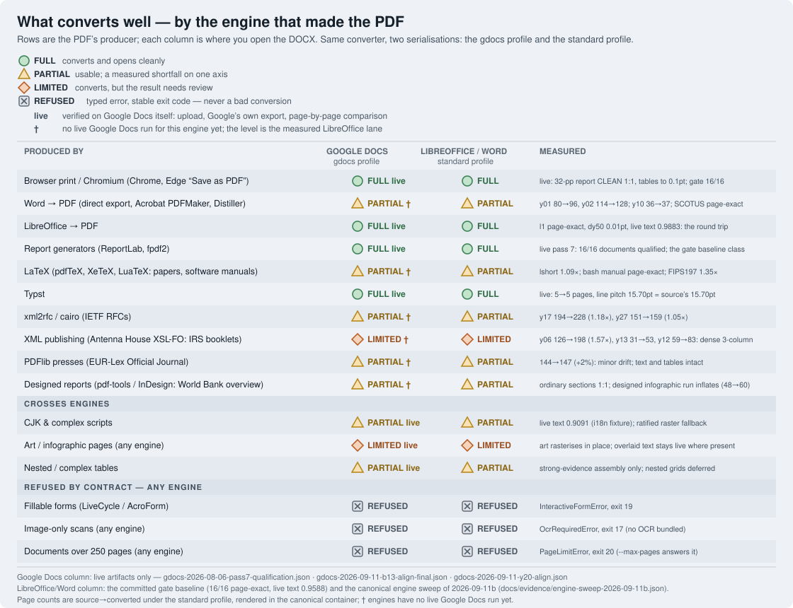

# Measured state: where exactdoc works, with the numbers

> Moved from the README in October 2026: the support matrix, the quality
> examples, the measured state at the 1.0.0 record, the Google Docs profile's
> live measurements and the cross-platform determinism notes, as they stood.
>
> The **current** gate numbers live in
> [`testkit/gate_baseline.json`](../../testkit/gate_baseline.json): product lane
> 16/16 pages match, mean within-2pt 0.6019, mean live text 0.9635, median dy50
> 0.525pt; raw lane 15/16, 0.4568, 0.9635, 1.245pt. The latest live Google Docs
> qualification is
> [pass 9b](../evidence/gdocs-2026-10-04-pass9b-qualification.json) (overall
> pass, zero blocking findings), and the first live Google Docs sweep of the
> expansion corpus is [here](../evidence/gdocs-live-sweep-2026-10-04.json).
> [CHANGELOG.md](../../CHANGELOG.md) records how the numbers got there.

## Where it works, and where it does not



The matrix is organised the way you meet the question: rows are the engine
that produced the PDF (the producer string any PDF inspector shows), columns
are the renderer the DOCX will be opened in. Both columns are the same
converter — only the serialisation differs (`gdocs` vs `standard` output
profiles).

The headline the sweep carries: office and web producers — Word, LibreOffice,
Chromium-printed pages, ReportLab-style generators — land between page-exact
and 1.22× reflow, and three real documents land page-exact (the 114-page
Distiller-set SCOTUS opinion, the 214-page GNU Bash manual, and the Typst
specimen on Google's own render). Typst landed
page-exact on Google's own render. The measured weak class is dense designed
multi-column booklets (the IRS instruction books, 1.4–1.7×), and the refusals
are contractual, not quality failures: fillable forms, scans without a text
layer, and documents over the 250-page cap.

Cells marked **live** carry a live Google Docs artifact: the DOCX went to
Drive through the API, Google's own PDF export came back, every page was
aligned against the source by text content and the renders inspected
([pass 7](../evidence/gdocs-2026-08-06-pass7-qualification.json), the
[2026-09-11 campaign](../evidence/gdocs-2026-09-11-b13-port-round1.md) —
a 32-page Chromium-printed report at CLEAN 1:1 — and the Typst specimen).
Cells marked † have no live run for that engine yet and carry the measured
LibreOffice-lane level. The LibreOffice/Word column is the gated lane: the
committed gate baseline for the synthetic corpus, and the
[2026-09-11 engine sweeps](../evidence/engine-sweep-2026-09-11b.json) —
every real-producer fixture converted and rendered in the canonical
container — for the engine rows. [limitations.md](limitations.md) repeats
the matrix in prose, with the numbers.

For the Google Docs column specifically, the confirming measurement is always
the live test: the DOCX goes to Drive through the API, Google's own PDF export
comes back, every page is aligned against the source by text content, and the
renders are inspected. Offline proxies are used for triage only — Docs
mistranslates enough OOXML (and LibreOffice mispredicts enough Docs) that a
local render has never been accepted as evidence for this column.

## What to expect (quality examples)

Typical results from the measured corpus, described in words (the
[README](../../README.md) shows rendered examples):

- **A three-page business whitepaper** (cover band, headings, callout boxes,
  a bar chart, numbered and bulleted lists, footer with page numbers) converts
  to a fully editable document: the coloured cover band is a real table with
  live text, the chart is rasterised in place, callouts keep their tinted
  backgrounds and border bars, and body text lands within ~1–2pt of the
  source. You can retitle the cover and re-wrap paragraphs like any Word file.
- **A two-column academic paper** with an inset abstract keeps its two-column
  section: column boundaries, the abstract inset, superscripts and references
  survive, and the column geometry is inferred from the page itself — no
  template assumptions.
- **A technical report with code blocks** keeps code as monospace text in
  shaded single-cell tables with preserved indentation — editable, not an
  image.
- **A 45-row striped table** spanning three pages becomes one continuous
  editable DOCX table with every row present exactly once, paginating
  naturally.
- **An international text page** (CJK, Cyrillic, Greek, accented Latin)
  retains live, correctly positioned text through metric-compatible font
  mapping.

## Measured state

Shipping profile (quality-first): `pdfium/standard/libreoffice/refine3@240dpi`.
`raw` is the same path with refinement off. Canonical figures come from the
pinned Linux/LibreOffice CI environment:

| Canonical profile | Page match | Mean within 2pt | Mean live text | Median dy50 |
|---|---:|---:|---:|---:|
| product | 16/16 | 0.5274 | 0.9588 | 1.045pt |
| raw | 15/16 | 0.3615 | 0.9588 | 1.6pt |

Measured 2026-08-06, both lanes PASS. The regression record asks "did anything
get worse?", not "is everything perfect"; the absolute qualification still
exposes the Tier 2/3 items in [limitations.md](limitations.md).

**These numbers moved when the default parser did, and slightly for the worse.**
The baseline was re-recorded because `profile_id` changed from `pymupdf/…` to
`pdfium/…`, which makes the old record a description of a configuration nothing
ships. Every one of the 32 per-document movements reproduces
`docs/evidence/parity-expanded-2026-08-05f.json` — measured and ratified
*before* the swap — to the recorded digit, and a control run confirmed the old
parser still reproduces the old record exactly from this tree, so the movement
is the parser and nothing else. See
[docs/evidence/parser-default-flip-2026-08-06.json](../evidence/parser-default-flip-2026-08-06.json).

**These figures describe every install.** They did not for one day: the
measurement environment carries the `[mupdf]` extra for the parity reference
arm, the quality ladder needed that extra to shape text, and a default install
therefore ran an inert ladder and produced worse output on `c1_whitepaper`,
`l1_word_native` and `c4_i18n`. `exactdoc/metrics.py` now ships the published
Adobe AFM widths, so both installs shape text with the same tables — verified by
converting all 16 fixtures in a virtualenv that never had PyMuPDF and comparing
the DOCX content hash against the measurement environment's. Identical on all
16, so `profile_id` needs no text-metrics term. See
[docs/evidence/permissive-shaper-2026-08-06.json](../evidence/permissive-shaper-2026-08-06.json).

A separate, deliberately **non-gating** corpus of 29 further documents — 16
generated, 13 real documents this project did not write — lives in
`testkit/fixtures_expansion/`. It is measured by `testkit/parity_expansion.py`,
has no baseline, and gates nothing; see
[docs/corpus-expansion.md](../corpus-expansion.md). It is what found two of the
limitations in [limitations.md](limitations.md), and it earned its place by embarrassing the gated corpus:

- running headers, footers and browser page furniture dominate the geometry
  error in ordinary documents — a construct the frozen 16 barely sample;
- page inflation on long dense documents is invisible to a 1–7 page corpus,
  because a per-page error cannot compound into a page-count error there. No
  gated number has ever moved in response to it;
- a 199-widget fillable form once converted anyway, at 0.085 SSIM while exiting
  zero. That is the measurement that produced the refusal contract and exit
  code 19 — the limitation became a typed error rather than staying a surprise.

### The Google Docs profile — measured live, still not the shipping profile

`pdfium/gdocs/none/refine0@240dpi`. The parser in that name is now simply the
default; what still makes this profile non-shipping is the pair of axes after
it — Google-safe serialisation with the correction loop off.

**Four** consented live Google qualifications ran on 2026-08-04, all
operationally successful — 16/16 documents attempted and succeeded, zero
failures, zero orphaned Drive objects — with blocking quality findings falling
**11 → 4 → 3 → 1** across the day. The vertical-drift blockers were a 3pt
per-boundary spacing compensation, retired after remeasurement against Google's
own exports put the real figure near +0.1pt; `l1_word_native` horizontal drift
was a font-substitution error, fixed by adopting Libre Baskerville from
Docs-measured metrics (39.82 → 1.35pt); `c2_paper2col` cleared its similarity
bound on a scoped section-break compensation (0.6772 → 0.7087).

Twelve of the thirteen blocking fixtures now clear every threshold unaided. The
thirteenth, `01_whitepaper_market`, misses only structural similarity, because
Google Docs adds space above a page-leading cover band unconditionally — probe
measured, an addition rather than a clamp, and the writer already compensates
what is compensable. The quality policy has been **ratified** with a single
bounded waiver for exactly that metric on exactly that document, floored just
below the measured value, and it retires itself: if `01` reaches the bar unaided
the waiver goes stale and blocks until it is deleted.

Assessed against the fourth pass, the ratified policy returns `overall_pass:
true` with zero blocking findings, and a second fresh consented run made two
clean passes — which is what the migration gate asked for.

Same-profile PDFium/PyMuPDF parity is **ratified and closed**
([docs/evidence/parity-expanded-2026-08-05f.json](../evidence/parity-expanded-2026-08-05f.json)),
which is what let the parser default change. Four findings sit at the shipping
profile — `02_research_paper` and `03_tech_report_code` (within-2pt and drift),
`r1_reportlab_report` (within-2pt), and `c4_i18n` (complex-script runs becoming
raster, a D10 shortfall). Those four are why the gate baseline moved, and all of
them were measured and adjudicated *before* the swap, against Google's own
exports rather than the LibreOffice proxy. **No policy here was ratified merely
to turn a gate green**, and a ratified finding is not a fixed one: each stays
floored in both directions, and clearing one entirely still fails as a stale
record. See [status.md](status.md) for the full numbers.

Google qualification is separate, two-step and consent-gated:

```bash
python testkit/gdocs_oracle.py prepare <dir>              # offline, hash-binds the candidate
python testkit/gdocs_oracle.py run <dir> --allow-cloud-upload   # the only step that uploads
python testkit/gdocs_oracle.py assess <gdocs_qualification.json> # re-assess without uploading
```

## The same DOCX everywhere — with one measured caveat

Conversion consults **no system fonts**. The base-14 text metrics are the
published Adobe AFM widths, compiled into the package
(`exactdoc/_base14_widths.py`); PDFium reads the fonts the PDF itself embeds.
Nothing in the layout path asks the operating system what a glyph is worth, so a
Linux user and a Windows user get the same *text geometry* from the same input.
The most font-sensitive fixture in the corpus, `c4_i18n` (CJK, Arabic and
Hebrew), converts **byte-identical** across the two platforms, as do
`l1_word_native`, `c7_code`, `c8_toc_links`, `c6_long` and `c2_paper2col`.

The DOCX is **not** byte-identical in general, and it would be wrong to claim it
is. Measured Windows-against-container on all 16 gated fixtures at the RAW
profile: 6 match exactly, and 10 differ. All six documents carrying a rasterised
figure region differ by hundreds of bytes — image encoders are not required to
be reproducible across platforms — and four documents with no image at all
differ by 2 to 11 bytes, a cause this project has not yet chased down.
Conversion is deterministic on a *given* machine: two runs produce identical ZIP
members on all 16.

What a reader sees is a separate question from what a hash sees. Google Docs
renders with Google's fonts, so a document opened there looks the same for
everyone; Word and LibreOffice substitute from locally installed fonts, exactly
as they do for any DOCX from any source.

## Verification

```bash
bash scripts/bootstrap.sh --strict
python testkit/corpus_manifest.py verify
python testkit/runall.py
python tests/test_gate_mutations.py
```

See [status.md](status.md) for the measured state and defects,
[roadmap.md](roadmap.md) for sequencing, and [theory.md](theory.md) for the
laws the codebase is built around.
